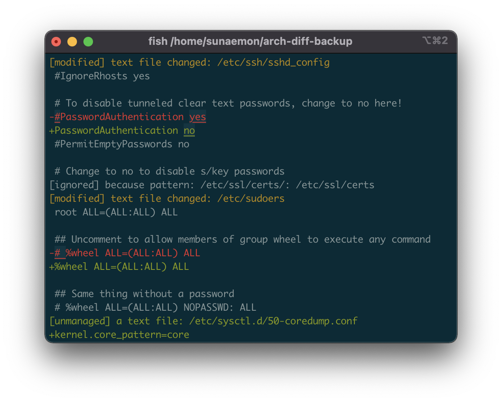

```
$ git clone https://github.com/sunaemon/arch-diff-backup.git
$ cd arch-diff-backup
$ cargo build --install
```


これ自体は--outdir以下にbackup.shとrestore.shを生成するだけで、何も書き込まない
```
$ sudo -E arch-diff-backup run --outdir backup
```

現在のシステムにインストールされているpkgおよび、restore.shに書き込めない大きなファイルやバイナリファイルなどをbackup以下にコピーします
```
$ cd backup
$ bash -x backup.sh .
```

arch linuxのインストールマニュアルのpacstrapの直前まで行って、以下のようにすることでリストアができます。

```
$ bash -x restore.sh . /mnt
```



